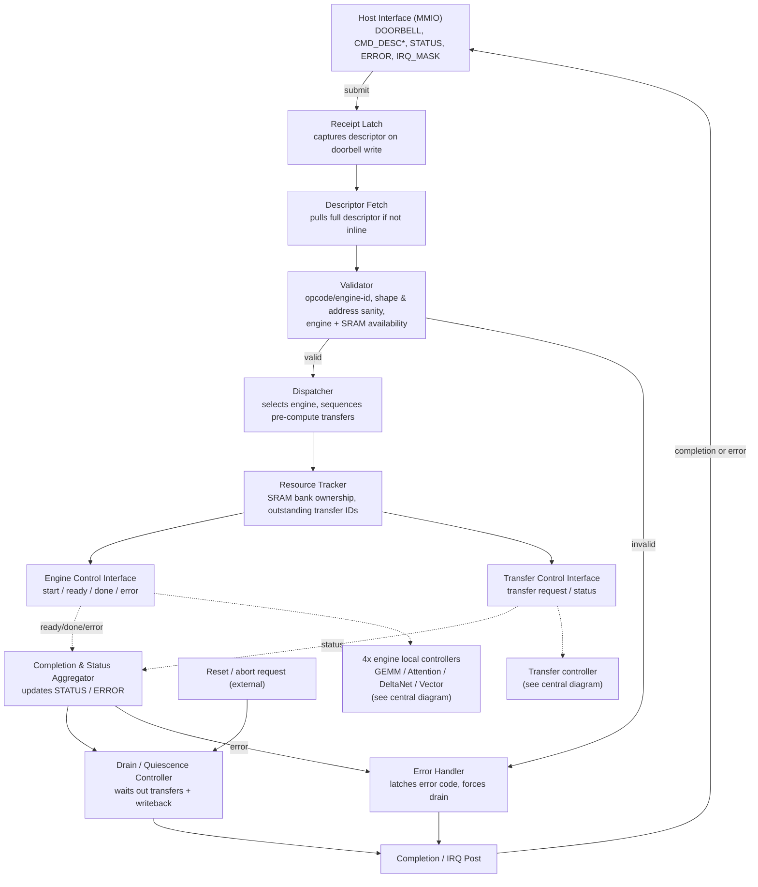
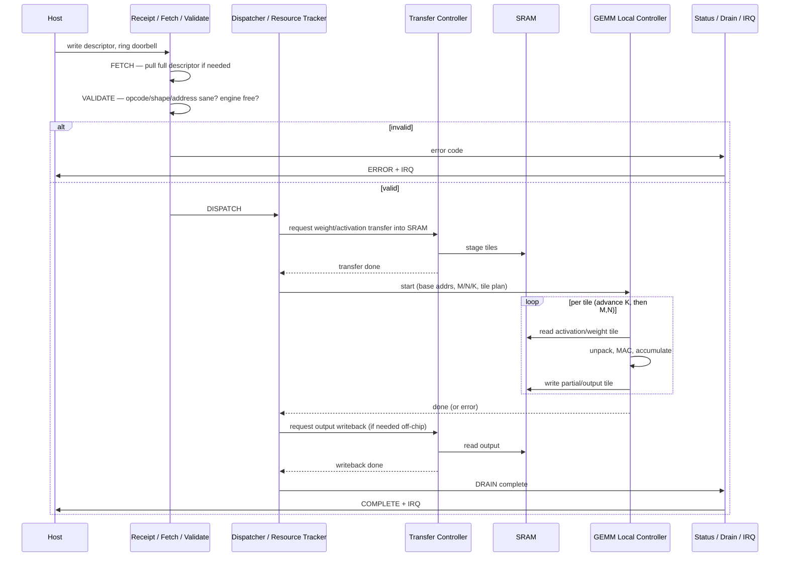

# Top-Level Control Architecture (Proposal)

**Repo:** `rtl-control`
**Status:** Draft for review — internal structure and command walkthrough only. MMIO register map / descriptor fields to follow once llama.cpp op-tracing material is reviewed (tracked as a follow-up, see §12).
**Relation to central diagram:** This document expands only the "Top-level command controller" box from the [central architecture diagram](https://github.com/SiliconBadgers/architecture/blob/main/docs/accelerator-diagram.md). Everything outside that box (the four engine candidates, SRAM, transfer controller, platform memory) is referenced, not redrawn — the central diagram stays the single source of truth for the system-level picture.

---

## 1. What this controller actually does

Plain-language version before the diagrams: the top-level controller is a single sequencer, not a processor. Per command it:

1. Notices the host submitted something (doorbell).
2. Reads and sanity-checks the command (validate).
3. Makes sure the right data is sitting in local SRAM before compute starts (this is a transfer request, handled by the existing transfer controller — the top-level controller just asks for it and waits).
4. Tells exactly one of the four engine local controllers to start, and waits.
5. Once the engine is done and any output has been written back, tells the host it's complete (or reports an error).

There is no instruction decode, no branching program counter, no register file to manage — that's the CPU instruction-decoder mental model this task explicitly says *not* to reach for. This is closer to a state machine that runs a fixed sequence for every command, with the *content* of a couple of steps depending on which engine the command targets.

## 2. Proposed internal blocks

| Block | Job |
|---|---|
| Host Interface (MMIO) | Doorbell, descriptor registers, status/error registers, IRQ line — the only thing the host touches |
| Receipt Latch | Captures the descriptor pointer/fields the instant the doorbell is written; nothing before this exists as "in-flight work" |
| Descriptor Fetch | Pulls the full descriptor if it isn't entirely inline in MMIO registers (open question, §8) |
| Validator | Checks opcode/engine-id, tensor shape and address sanity, and that the target engine + needed SRAM are actually available |
| Dispatcher | Picks the target engine, sequences any pre-compute transfer(s), then issues `start` |
| Resource Tracker | Owns bookkeeping: which SRAM banks are claimed, which transfer IDs are outstanding. Trivial under the single-in-flight-command assumption (§5); becomes real work if that assumption is relaxed later |
| Engine Control Interface | The existing `start/ready/done/error` handshake to the four local controllers — this document doesn't change that interface, just says who drives it |
| Transfer Control Interface | The existing `transfer request/status` handshake to the transfer controller |
| Completion & Status Aggregator | Collects `done`/`error` from the engine and status from the transfer controller; updates STATUS/ERROR registers |
| Drain / Quiescence Controller | Holds COMPLETE (and any reset) until outstanding transfers and engine writeback have actually finished |
| Error Handler | Latches an error code, aborts remaining steps for that command, forces a drain, reports to host |
| Completion / IRQ Post | Final step: updates STATUS, asserts IRQ |

## 3. Block diagram

This maps onto the existing FSM (`IDLE → FETCH → VALIDATE → DISPATCH → EXECUTE → DRAIN → COMPLETE`) as: FETCH/VALIDATE = Receipt+Fetch+Validator; DISPATCH = Dispatcher+Resource Tracker; EXECUTE = the period where Engine/Transfer Control Interfaces are active and Status Aggregator is collecting; DRAIN/COMPLETE = Drain Controller + IRQ Post.

## 4. Representative walkthrough: one GEMM (matrix-multiply tile) command

Chosen because it's the simplest candidate engine (no running state like Attention's softmax or DeltaNet's decay) and still exercises every stall/backpressure/error path.

**Who owns each step:** Receipt/Fetch/Validate and Dispatcher are entirely in the top-level controller's own logic — no external dependency. The transfer step is owned by the (existing) transfer controller; the top-level controller only issues the request and waits on status. The compute loop is entirely owned by the GEMM local controller; the top-level controller is idle during this — it doesn't micromanage individual MAC cycles or tile boundaries, that's the local controller's `Clear, fetch, wait / Unpack and MAC; advance K / Store; next M,N tile` sequence from the central diagram.

**When data is ready:** GEMM local controller isn't started until the transfer controller reports the pre-load done — so from the GEMM local controller's point of view, its first SRAM read is always guaranteed valid. It never has to poll or wait on the transfer controller itself.

**What stalls:** the whole command stalls waiting on transfer completion before EXECUTE begins, and stalls again waiting on writeback completion before COMPLETE. Within EXECUTE, any stalling (e.g., SRAM bank contention) is internal to the GEMM local controller / datapath and invisible to the top-level controller, which only sees the eventual `done`.

## 5. Baseline execution model: single command in flight

Proposed baseline: **the top-level controller accepts and fully retires one command before fetching the next.** No two engines run concurrently, no pipelining of DISPATCH for command N+1 while command N is still in EXECUTE.

Why: this matches what's actually drawn in the central diagram (one FSM, one thread of `start/ready/done/error` to the engines, one thread of `transfer request/status` to the transfer controller) and keeps the Resource Tracker trivial for a first pass — there's nothing to arbitrate when only one thing is ever active. It also gives Verification a much smaller behavior surface to close on first.

**Open question flagged for the team:** llama.cpp inference is a long chain of small ops issued back-to-back. Single-in-flight means the host stalls (or the controller queues, if we add queue depth) between every op. Whether that's acceptable throughput, or whether we need to pipeline DISPATCH of the next command during this command's DRAIN, is a real design decision — proposing we default to the simple version now and revisit once Compute has rough per-op latency numbers.

## 6. Stalls, backpressure, errors, reset — summary

| Condition | Behavior |
|---|---|
| Host submits while a command is already in flight | Backpressure: DOORBELL write is either ignored/NACKed or the command is queued (queue depth is an open question, §8) — controller does not accept a second command mid-flight under the single-in-flight baseline |
| Validator finds a bad descriptor | No engine or transfer is ever started; error code latched, STATUS/ERROR updated, IRQ asserted, controller returns to IDLE |
| Local controller reports `error` mid-EXECUTE | Dispatcher stops issuing further transfer requests for this command, Drain Controller waits out anything already outstanding, then Error Handler reports to host — no silent partial completion |
| Transfer controller can't service a request (backpressure from platform memory) | Command simply stays in its current state (DISPATCH waiting on pre-load, or DRAIN waiting on writeback) — no timeout logic proposed yet; open question for Memory, §9 |
| Reset requested mid-EXECUTE | Routed through the Drain Controller, not applied instantly — outstanding transfers/writeback are allowed to finish (or are explicitly aborted, TBD) before the controller resets, so SRAM/state isn't left half-written |
| Reset requested while IDLE | Immediate, nothing to drain |

## 7. Provisional descriptor sketch (placeholder only)

Not the deliverable this task asks for from the llama.cpp op-tracing slides — just enough to make §4 concrete. Expect this to be substantially revised in the architecture repo once those slides are reviewed.

- `opcode / engine_select` — which of GEMM / Attention / DeltaNet / Vector
- `src_addr[]`, `dst_addr` — platform-memory addresses (activations, weights, KV cache pointer where relevant, output)
- `shape/dims` — op-dependent (M/N/K for GEMM; seq_len/head_dim for Attention; etc.)
- `dtype/scale_format` — quantization/scale info for weight unpack
- `flags` — e.g. output-in-place vs. requires writeback, barrier/dependency bit if we ever support queuing

## 8. Open questions / info needed from Compute

- Per-engine local controller: is `done` asserted once per whole command, or incrementally per tile (affects whether Status Aggregator needs to track partial progress)?
- Rough per-op latency ranges (even order-of-magnitude) — needed to decide whether single-in-flight (§5) is acceptable or whether pipelining/queuing is required
- Does any engine (DeltaNet in particular, given its persistent state) need explicit "flush state" behavior on abort/reset, or is state naturally safe to gate off?

## 9. Open questions / info needed from Memory (transfer controller / SRAM)

- Does the transfer controller expose a way to distinguish "still working" from "can't service this request" (backpressure vs. stall), or does the top-level controller just wait indefinitely either way?
- SRAM bank granularity — does the top-level controller need to reason about *which* bank a transfer lands in, or is that entirely internal to the transfer controller/SRAM block? (Determines how much the Resource Tracker actually needs to track.)
- Any minimum/maximum transfer size or alignment constraints that Validator should be checking before a request is even issued?

## 10. What Verification needs to test

Behavior-level, not implementation-level — should hold regardless of how the above open questions resolve:

- A valid command always completes with STATUS/ERROR reflecting the *actual* outcome (no false-complete, no false-error).
- No completion/IRQ is ever posted while a transfer or engine is still outstanding for that command (drain ordering).
- An invalid descriptor never reaches the engine or transfer controller — validation must be a real gate, not advisory.
- An error mid-command doesn't leave the controller stuck (must reach IDLE again, ready for the next command) and doesn't leave outstanding transfers unaccounted for.
- Reset mid-command doesn't corrupt SRAM/state — i.e., the drain-before-reset behavior in §6 actually holds under test, not just in the diagram.
- Backpressure: submitting a second command while one is in flight has defined behavior (whatever we land on for the queue-depth question) rather than being undefined/lost.

## 11. Assumptions log

- Single command in flight at a time (§5) — biggest assumption in this document, explicitly open for pushback.
- Transfer controller and SRAM arbitration among the four engines is entirely out of scope here — assumed already handled by the existing transfer controller / SRAM block per the central diagram.
- No timeout/watchdog logic proposed yet for a transfer or engine that never responds — flagged, not solved.

## 12. Proposed follow-up to central architecture diagram

Nothing in this document changes the *central* diagram's boxes or arrows — it only adds detail inside the existing "Top-level command controller" box, so no interface change is being proposed back to Architecture yet. The one item likely to eventually feed back: if the single-in-flight assumption (§5) turns out to be too slow once Compute has latency numbers, the `start/ready/done/error` and `transfer request/status` interfaces may need to support multiple outstanding IDs rather than a single implicit one — that would be a real interface change worth raising with Architecture once we have data, not before.

**Separately tracked:** MMIO register map and command descriptor fields, once the llama.cpp op-tracing slide decks are reviewed (per the architecture-repo task).
